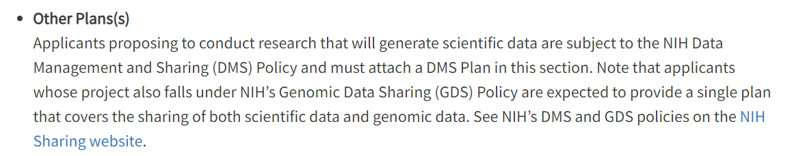
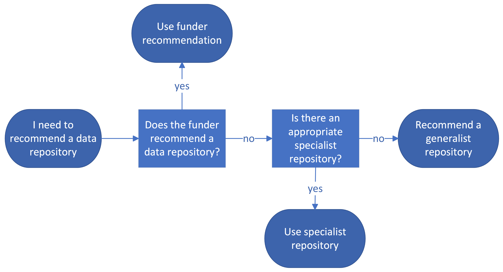

::: questions
- Where can one find Funder requirements?
- Example DMPs?
- Appropriate data repositories and data standards?
:::

::: objectives
1. find funder requirements for a DMP
2. Successfully search for example DMPs
3. Find FAIR data repositories appropriate for a patron's research project
4. Match a data type with appropriate data standards
:::

## Introduction
As librarians, we use a variety of resources to answer researchers’ questions, such as library databases like ERIC or PsycInfo, or reference sources like Credo. When answering data management plan questions, you will use a new set of resources. In this lesson, we will introduce you to places to find data management planning information to answer common researcher questions.

## Funder Requirements
Funders are increasingly including DMPs in their requirements for grant applications. Due to the 2022 Ensuring Free, Immediate, and Equitable Access to Federally Funded Research memo, colloquially known as the “[Nelson Memo](https://www.whitehouse.gov/wp-content/uploads/2022/08/08-2022-OSTP-Public-access-Memo.pdf)”, all federal granting agencies in the US are required to establish data sharing policies. When assisting a researcher writing a DMP for a grant application, the first step is to get a handle on the funder’s requirements for the plan.

Here are some places to check for funder requirements:

1. **The funding announcement.** Most grant programs create an announcement, which may be called by any of a number of acronyms such as a “CFP” (call for proposals) or “NOFO” (Notice of funding opportunity) to publicize their funding opportunity. After navigating to the funding announcement, you can scan through the associated links to look for information on their data management plan requirements. Below, you can see the information provided in a National Institutes of Health Notice of Funding Opportunity:\
{alt="NIH NOFO DMP info.png"}\
In case the funding announcement does not have the information you need, proceed to the other items on this list.

1. **Funder application instructions or website.** Large funders will have a website set up to help researchers through the application process. Looking through the documentation can help you understand their requirements for data management plans. This example from the NIH application instructions redirects you to sharing.nih.gov, their website specifically for data sharing: {alt="NIH application instructions.PNG"}

1. [The SPARC directory of data sharing requirements](https://datasharing.sparcopen.org/) **of federal agencies.** SPARC stands for the Scholarly Publishing and Academic Resources Coalition, and is a non-profit that supports open research and education systems. Through this website, you can view and compare data sharing policies from top funding organizations.

1. **Google search.** Often googling *"[funder name]" "data sharing requirements" OR "data management plan" OR "dmp"* will direct you to the appropriate documentation.

1. **Contact the funder.** If you are still not sure about what guidance to follow, consider reaching out to the research office contact in the funding announcement.

## Example DMPs

After locating the funder requirements, researchers may find it usefful to see an example DMP written by others as part of their application to the same program or funding agency.

Here are some places to check when looking for example DMPs:

1. **University libguides.** Many research university libraries have created libguides that provide researchers with guidance on writing DMPs. Some library resources include boilerplate templates for specific funding agencies, or successfully funded researcher DMPs. To find university libguides, you can either search through the LibGuides Community or search google for DMP AND [funding agency] AND [libguide](https://community.libguides.com/).

1. **DMPTool.** The [DMPTool](https://dmptool.org/) is a free online application that helps guide researchers through writing plans, and even allows librarians to provide feedback along the way. The website [maintains templates](https://dmptool.org/public_templates) based on funder and program requirements, in addition to hosting public DMPs created by researchers using the DMPTool. In the [public DMPs](https://dmptool.org/public_plans) list, you can narrow your search by funding agency to find relevant examples. We will explore the DMPTool more in Episode 4.

1. **Funder example DMPs.** Some funding agencies, [like the NIH](https://sharing.nih.gov/data-management-and-sharing-policy/planning-and-budgeting-for-data-management-and-sharing/writing-a-data-management-and-sharing-plan#sample-plans), have created example DMPs to provide researchers an idea of what they would like to see as part of their grant applications. 

1. **Grant agencies DMP repositories.** Some granting agencies share data management plans submitted as part of grant applications through a public repository. An example of this is the Department of Transportation’s (DOT) [repository & open science access portal (rosap)](https://rosap.ntl.bts.gov/gsearch?collection=&terms=DMP+data+management+plan).

1. **Example DMS plans website.** The Working Group on NIH DMSP Guidance created the [Example DMS Plans website](https://example-dms-plans.github.io/examples/), which aggregated stable versions of publicly available DMPs. It was compiled ahead of the rollout of the NIH DMS Policy.

## FAIR Data Repositories

In data management, we often speak of making data “FAIR.” [FAIR](https://www.go-fair.org/fair-principles/) is an acronym for Findable, Accessible, Interoperable and Reusable. Using these principles, we can evaluate the “openness” of a data set. Repositories should promote these characteristics in order to make data housed there user-friendly.

According to the [NNLM’s data glossary](https://www.nnlm.gov/guides/data-glossary/repository), “a repository is a tool to share, preserve, and discover research outputs, including but not limited to data or datasets.” Generally, a data repository is a website that houses a collection of datasets, making them available to a broad(er) audience. Repositories manage data sharing infrastructure and provide a stable location for researchers to share their work.

Why choose a data repository? For most researchers, a data repository is the best practice for data sharing. Using a personal or lab website or even uploading the dataset in journal article supplementary files is not advisable because the long term sustainability of the website is unknown: it can be updated or taken down without warning. In addition, simply adding “available upon request” to the data availability statement in a publication is not sufficient. [Studies have demonstrated](https://www.sciencedirect.com/science/article/abs/pii/S089543562200141X) a lack of author compliance when data is actually requested.

::: callout
In addition to lack of sustainability, personal websites, article supplementary files and availability upon request are typically difficult to find. Data repositories mints DOIs, digital object identifiers, providing persistent access to data even if it is updated or moved, and will provide reasoning for removal if the dataset needs to be taken down. Data repositories also provide structures that link README files or other metadata schemas to the dataset, allowing for greater reusability in the future.
:::

Through repositories, several options are available to researchers for data sharing:

- **Public access.** Public datasets are available to all without restriction. This is commonly used for animal studies or data without privacy concerns.
- **Controlled access.** In a controlled access repository, researchers must verify their identity before they are allowed to download and analyze data. This can take the form of verifying a university-associated email address, signing a data use agreement, or sending in an application before access is granted. Some repositories, such as Vivli, which specializes in clinical trial data, require that sensitive data be analyzed in a controlled cloud computing environment. Others, like ICPSR, may require that their restricted datasets be accessed on-site, using a computer not connected to the internet.
- **Embargoes.** Most repositories allow for datasets to be embargoed. Data sets may be embargoed for a number of reasons. For example, the researchers may not wish to publish their data until the accompanying article is available, or they may be pursuing a patent based on their discoveries.

Here are the types of data repositories that researchers can use for sharing data:

- **Specialist data repository.** Specialist data repositories accept scholarships from certain disciplines or on a specific topic. These include [ICPSR](https://www.icpsr.umich.edu/), the inter-university consortium for political and social research. 
- **Generalist data repository.** Generalist data repositories accept any scholarship from any discipline. These include [Figshare](https://figshare.com/), [Zenodo](https://zenodo.org/), [Mendeley](https://data.mendeley.com/), and [OSF](https://osf.io/). Other generalist repositories include [Vivli](https://vivli.org/), which only accepts clinical data, and [Dryad](https://datadryad.org/), which primarily accepts data from the sciences.
- **Institutional data repository.** Some institutions host their own data repository to encourage their researchers to deposit data. These are typically limited to affiliates of the host institution, though you should check if your researcher’s collaborators are affiliated with an institution hosting a data repository. Other institutional repositories, like the [Harvard Dataverse](https://dataverse.harvard.edu/), allow any researcher to deposit their datasets regardless of affiliation.

::: callout
Institutional repositories vary in their ability to accept and maintain data. Before commiting to using an institutional repository, check that they routinely accept data.
:::

Recommending a data repository for inclusion in a DMP can be challenging. Generally, it is best to recommend a specialist repository, followed by an institutional or generalist repository. Here are some tools to help you find the right data repository for your researcher:

- **Repository indices.** Locating the right data repository for your researcher among the thousands in existence may be challenging, especially if you are not familiar with where others in the discipline are depositing their datasets. Luckily, there are a number of repository indices that aggregate data repositories and provide filters to facilitate pinpointing the one that works best for your researcher. [FAIRsharing](https://fairsharing.org/) and [re3data](https://www.re3data.org/) are good starting points when you are not aware if a specialist repository exists for a given discipline.
- **Funder recommendations.** Some funders like the [AHA](https://professional.heart.org/en/research-programs/awardee-policies/aha-approved-data-repositories) or the [NIH provide recommendations](https://sharing.nih.gov/data-management-and-sharing-policy/sharing-scientific-data/repositories-for-sharing-scientific-data) for where their funded projects should share their data after the active research phase has concluded– the [NNLM Data Repository Finder](https://www.nnlm.gov/finder) provides more guidance for finding an NIH-supported repository.
- **Publisher recommendations.** For researchers without funding or whose funders provided no guidance on which data repositories to use, some publishers like [Nature have requirements](https://www.nature.com/sdata/policies/repositories) where researchers should deposit their data before their articles are published.

::: callout
Publishers requiring data deposit before article publication will also require a data availability statement, a description of where the dataset is publicly available, located at the bottom of the article.
:::

## Metadata and data standards

According to the [NNLM data glossary](https://www.nnlm.gov/guides/data-glossary/data-standards), a data standard is “a type of standard, which is an agreed upon approach to allow for consistent measurement, qualification or exchange of an object, process, or unit of information. [...] Data standards refer to methods of organizing, documenting, and formatting data in order to aid in data aggregation, sharing and reuse.”

Data standards help to promote the FAIR principles. By using a data standard when creating and describing their data, researchers make their data easier to discover and reuse. For instance, if you use a standardized survey instrument when collecting data, your data can be easily compared and combined with the results of other researchers using the same instrument.

Some of the most common data management questions data librarians receive revolve around standards. Many researchers, even if they support the principles of open science, are not trained to find and utilize data standards. Often, they are not thinking about their process from the point of view of data reuse. For librarians, data standards present an opportunity for us to educate researchers.

There are many types of data standards, including:

- **File type.** When curating a dataset to share, researchers should convert their data to an [open file format](https://opendatahandbook.org/guide/en/appendices/file-formats/). For instance, spreadsheets should be made available as a CSV rather than an excel document (XLSX). Using standardized open file types is a data standard.
- **Controlled vocabularies/ontologies.** A controlled vocabulary ensures data standardization by limiting the number of terms that can be used in a given field. Librarians often use controlled vocabularies when cataloging, for example [MESH](https://www.ncbi.nlm.nih.gov/mesh/) for medical subject terms, or the [Getty AAT](https://www.getty.edu/research/tools/vocabularies/aat/index.html) for art terms. Researchers can also use controlled vocabularies in their work to ensure interoperability across studies.
- **Minimum information.** Minimum information standards, such as the [MINSEQE](https://zenodo.org/record/5706412), specify the minimum amount of metadata and data required for different data types. This helps to facilitate reuse and prevent mystery datasets without documentation from coming into a repository.
- **Metadata schema.** A metadata schema defines the elements of metadata for an object and how those elements can be used to describe a specific resource. Many librarians are familiar with metadata schemas such as [MARC](https://www.loc.gov/marc/) or [Dublin Core](https://www.dublincore.org/), but there are also specialized metadata schemas for particular research fields.

Finding appropriate data standards can be tricky for both librarians and researchers. The data standard landscape is still evolving, and the availability of data standards varies widely by field. There may be no widely accepted standard for a researcher’s project. If there is a lack of appropriate data standards, this information should be included in the DMP.

One strategy when answering reference questions about data standards is to work backwards. If you or the researcher have already picked out a data repository, look in the documentation of that repository to find what data standards they are using. For example, the [NIMH National Data Archive](https://nda.nih.gov/) has a page describing their data standards.

If working backwards isn't possible, here are some resources to find data standards:

- Research data alliance [metadata standards catalog](https://rdamsc.bath.ac.uk/)
- [Fairsharing](https://fairsharing.org/) has a registry of standards
- [Bioportal Ontologies](https://bioportal.bioontology.org/) catalogs ontologies, with a biomedical focus

## Quiz

As part of an intervention study, a researcher will be conducting surveys of adolescents in the juvenile justice system who have exhibited suicidal behavior. In addition to surveys, there will be in-depth interviews with some of the research subjects. The results will eventually be published in a peer-reviewed journal. Accordingly, the datasets will be shared and preserved. The researcher has learned that their University has an institutional repository that has not typically collected scientific data.

::: challenge

## Which of the data types mentioned would be applicable to the data management plan?

a. The interviews (qualitative)
b. The survey data (quantitative)
c. Both

::: solution
c. Both
:::

## What aspects of managing and sharing this data should this researcher consider as they prepare their data management plan?

a. The choice of repository.
b. Usage of standard questionnaires for the survey.
c. Facilitating the potential reuse of the data.
d. All of the above

::: solution
d. All of the above
:::

## Which repository is most appropriate for this researcher's dataset?

a. [ICPSR](https://www.icpsr.umich.edu/web/pages/)
b. [Dryad](https://datadryad.org/stash)

::: solution
ICPSR

The example study contains sensitive data because it deals with a non-adult incarcerated sample exhibiting suicidal behavior. In order to be shared, it requires additional safeguards. ***Dryad*** does not have a controlled access feature and therefore is not an appropriate choice in this case. ***ICPSR*** aligns more with the discipline of this study, and requires researcher screening and secure access before data can be viewed.
:::

:::

::: challenge
## Think-Pair-Share (Optional activity)

A researcher who is planning to conduct a clinical trial for a new Multiple Sclerosis medication comes to you. They know that their funder will require them to submit a DMP and share their data. They need to find what data standards are common for clinical trials and decide which repository to deposit their data.

1. Recommend a repository for this researcher.

1. Recommend a data standard this researcher could consider using.

Discuss your answer and how you arrived at that conclusion with a partner.

::: solution
1. Answers will vary, but one acceptable response is Vivli. To find which data repositories accept clinical trial data, use the NNLM data repository finder and check off “Clinical Trials” under question 4.
1. Answers will vary. We can see [Vivli’s guidance on data standards](https://vivli.org/wp-content/uploads/2023/01/NIH-DMSP-Template-and-Budget-Justification-Using-Vivli-v1.0.docx#:~:text=VIVLI%20Notes%3A%20Vivli%20does%20not,%2C%20csv)%20used%20for%20analysis.), where they recommend following [CDISC standards](https://www.cdisc.org/standards/therapeutic-areas).
:::

:::

